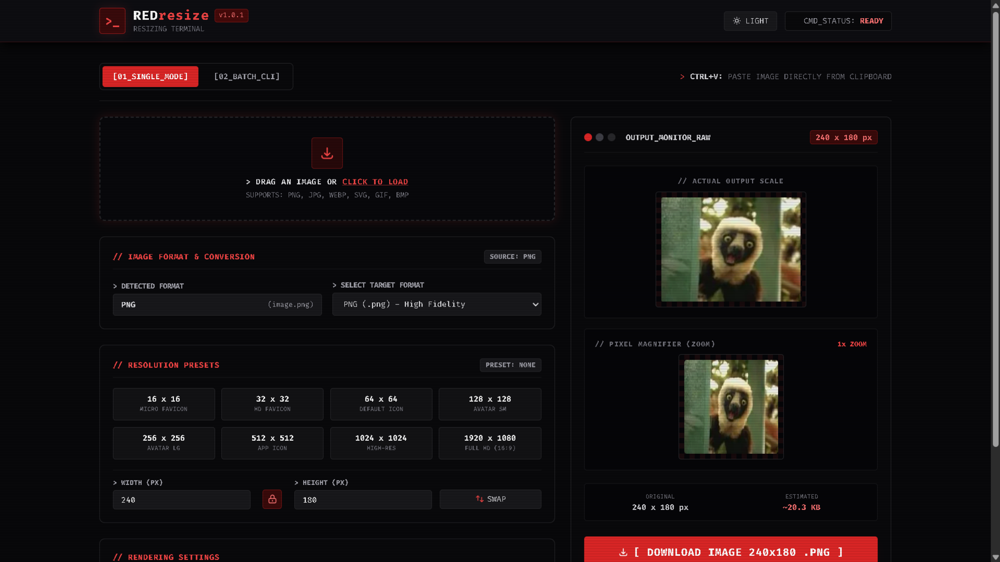

<p align="center">
  <h1 align="center">REDresize</h1>
  <p align="center">Aplicação web para redimensionamento e conversão de imagens com interface CLI retrofuturista.</p>
  <p align="center">
    <a href="README.md">English</a> · <strong>Português</strong>
  </p>
  <p align="center">
    Uma aplicação web leve para redimensionar, converter e inspecionar imagens diretamente pelo navegador do usuário, usando HTML, JavaScript Puro e Tailwind CSS.
  </p>
  <p align="center">
    <a href="https://vinicius-jose45.github.io/REDresize/"></a>
  </p>
  <p align="center">
    
    <a href="https://github.com/Vinicius-Jose45/REDresize/blob/main/LICENSE"></a>
    
    
    <a href="https://github.com/Vinicius-Jose45/REDresize/stargazers"></a>
  </p>
</p>

---

## 🚀 Visão Geral

O **REDresize** é uma aplicação web focada em redimensionamento e conversão de imagens, construída com uma interface temática inspirada em um terminal de linha de comando retrofuturista (CLI). O projeto opera 100% do lado do usuário (client-side) no navegador, utilizando HTML, JavaScript Puro e Tailwind CSS, garantindo máxima privacidade e velocidade sem envio de arquivos para servidores externos.

---

## ✨ Funcionalidades

### 📸 Single Mode (Edição Individual)
* **Importação Flexível:** Arraste e solte (*drag-and-drop*), selecione arquivos ou cole diretamente da área de transferência (`CTRL+V`).
* **Conversão de Formatos:** Suporte para conversão entre PNG, JPEG, WEBP e ICO, com controle de qualidade.
* **Controle de Resolução:** Atalhos para presets comuns (de 16x16 para micro-favicons a 1920x1080 para Full HD) e ajuste manual de largura/altura com trava de proporção (*aspect ratio*).
* **Opções de Renderização:**
  * Modos de preenchimento do canvas: *Cover*, *Contain* e *Stretch*.
  * Seleção de cor de fundo.
  * Algoritmo de suavização: Alternância entre alta qualidade (*Bicubic*) e bordas nítidas sem desfoque (*Nearest Neighbor*).
* **Monitoramento em Tempo Real:** Painel duplo com exibição em escala real e lente de aumento (*Pixel Magnifier*) para inspeção. Exibe estimativa em tempo real do tamanho final do arquivo (Bytes, KB, MB).
* **Exportação:** Download direto, cópia dos dados da imagem para a área de transferência ou exportação como **Icon Kit** (pacote `.zip` com a imagem em 6 tamanhos padronizados gerado via JSZip).

### 📦 Batch CLI (Processamento em Lote)
* Processamento paralelo de múltiplas imagens simultaneamente.
* Redimensionamento automático em lote para a resolução desejada.
* Agrupamento e download de todas as imagens processadas em um único arquivo `.zip`.

---

## 🎨 Design e Estética

* **Estética Cyberpunk:** Tipografia monoespaçada *Fira Code* com paleta focada em vermelho e cinza escuro.
* **Efeitos de Terminal:** Efeitos de brilho (*cmd-glow*) e sobreposição visual de linhas de varredura (*CRT Scanlines*) simulando monitores antigos.
* **Suporte a Temas:** Alternância fluida entre modo Escuro (*Dark*) e Claro (*Light*).

---

<!-- BANNER / PREVIEW DA INTERFACE -->
<p align="center">
  
</p>

---

## 🛠️ Tecnologias Utilizadas

* **HTML5**
* **JavaScript Puro (Vanilla JS)**
* **Tailwind CSS**
* **JSZip** (Geração de arquivos `.zip`)

---

## ⚙️ Como Executar

Por ser uma aplicação que roda 100% no navegador, não é necessária nenhuma instalação de servidor ou etapa de compilação!

1. Clone o repositório:
   ```bash
   git clone https://github.com/Vinicius-Jose45/REDresize.git
